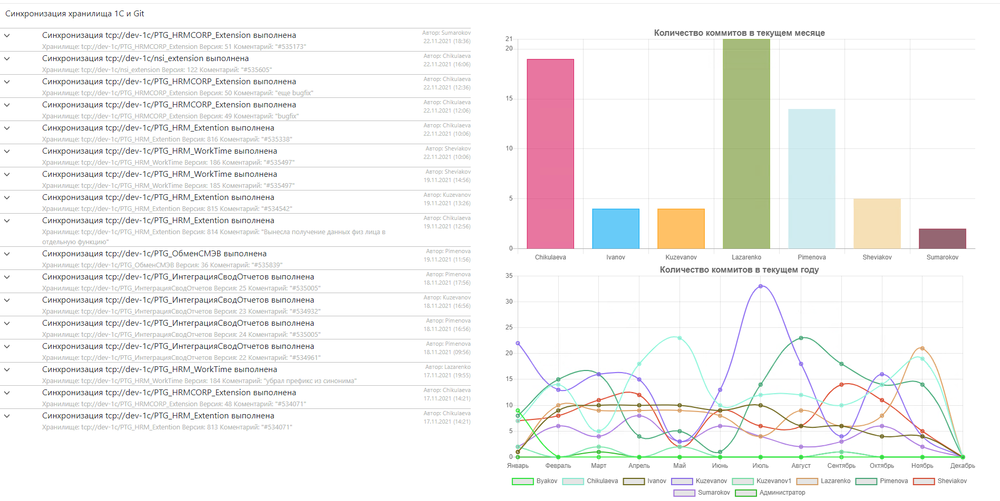

1C to Git
===========
#### Простая в настройки утилита для синхронизации хранилища 1С и GIT репозитория.

[](https://www.youtube.com/watch?v=Dk2Vyh5PRcQ)

Данное решение я постарался сделать максимально простым в настройки, по факту нужно два действия

 - Прописать настройки в конфиге 
 - Запустить exe

:warning:  Соответственно у вас уже должен быть локальный каталог и Git репозиторий с настроенной синхронизацией в этот каталог! 

:warning: При первом запуске программа начнет получать историю начиная с первой версии в хранилище 1С, если вы хотите загружать историю начиная с определенной версии, тогда в каталоге с программой необходимо создать файл (без расширения) с именем репозитория в котором указать версию с которой необходимо начать загрузку. 
Например мы хотим синхронизировать репозиторий "tcp://192.168.0.1/acc" начиная с 34 версии, создаем в каталоге с exe файл `versions` c содержимым :
```yaml
tcp://192.168.0.1/acc: 33
```

в файле может быть несколько строк, одна строка - одно хранилище
____


### Начать использовать
- Скачать актуальный [релиз](https://github.com/LazarenkoA/1C2GIT/releases) 
- Собрать в ручном режиме. Ставим [Go](https://blog.golang.org/), `git clone https://github.com/LazarenkoA/1C2GIT`, переходим в каталог, выполняем `go build -o "1C2GIT"` или `go build -o "1C2GIT.exe"`. (при использовании данного варианта версия будет 100% актуальная)

Конфигурационных файлов два, оба располагаются в каталоге **Confs**

 - **Config.conf** - основной в который вносятся настройки синхронизации
 - **MapUsers.conf** - не обязательный, для того что бы задать соответствия пользователя хранилища и git.

### Структура Config.conf
```json
{
    "Mongo": {
        "ConnectionString": "mongodb://127.0.0.1:27017"
      },
      "Bin1C": "C:\\Program Files\\1cv8\\8.3.13.1513\\bin\\1cv8.exe",
      "RepositoryConf": [
        {
          "TimerMinute": 30,
          "From": {
            "Rep": "tcp://....../.....",
            "Extension": true,
            "Login": "",
            "Pass": ""
          },
          "To": {
            "RepDir": "",
            "Branch": "Dev"
          }
        }
      ]
    }
```

 - **Mongo** - Содержит настройки подключения к Mongo DB. Не обязательный параметр, про плюсы использование mongo см. ниже.  
 - **RepositoryConf** - это массив, т.е. таких элементов может быть несколько 
	 - **TimerMinute** - расписание в минутах через сколько будет производиться синхронизация
	 -  **From** - тут настраивается подключение к хранилищу 1С.
		 - **Rep** - строка подключения к хранилищу, может быть как по tcp://, так и файловая шара.
		 - **Extension** - флаг того является конфигурация расширением или нет.
		 - **Login** - имя пользователя для подключения к хранилищу
		 - **Pass** - пароль для подключения к хранилищу
	 - **To** - тут настраивается выгрузка в git
		 - **RepDir** - Директория в которой создан репозиторий для хранилища
		 - **Branch** - Ветка в которую нужно коммитить

### Структура MapUsers.conf
```json
{
  "Имя пользователя хранилища 1С": "Ivanov <Ivanov@test.ru>",
  "Имя пользователя хранилища 1С2": "Petrov <Petrov@test.ru>",
  "Default": "Sidorov <Sidorov@test.ru>"
}
```
Формат пользователя Git обязательно такой должен быть как в примере. Default - это тот пользователь, который будет взят, если не найдено явного соответствия. Если не найдено явное соответствие и нет указание Default, или вообще нет данного конфигурационного файла, коммиты в Git будут делаться без параметра --author, т.е. под тем пользователем под каким настроен Git. 
##### Примеры конфигов можно посмотреть в каталоге Example


### Логирование 
Утилита поддерживает 4 уровня логирования
 - ошибка (2)
 - предупреждение (3)
 - информация (4)
 - дебаг (5)

Уровень debug самый подробный. По умолчанию используется уровень "предупреждение". Задать уровень логирования можно при запуске параметром -LogLevel=5. 
Логи складываются в каталог **Logs** расположенный в директории с программой. 

### Запуск как службы
Для запуска синхронизации в виде службы можно воспользоваться приложением nssm.

_nssm install 1C2GIT_ - Добавление службы

_nssm set 1C2GIT Description "Выгрузка хранилища 1С в Git"_ - Установить описание для службы

_nssm remove 1C2GIT_ - Удаление службы

Подробности см. readme в каталоге nssm-2.24


### Web интерфейс
http://localhost:2020

Обновления лога в веб интервейсе происходи через веб сокет, т.о. перезагрузка страницы не требуется, что бы эта фишка работала нужно  
в html\index.html в строке 
`conn = new WebSocket("ws://127.0.0.1:2020/notifications");`
установите имя своего хоста вместо 127.0.0.1


В web интерфейс выводятся как ошибки, так и информация о том, что произошла очередная синхронизация


Для корректной работы web интерфейса необходимо в конфиге подключить Mongo DB. Без Mongo DB работать тоже будет, но в таком случае
информация по коммитам накапливается в памяти приложения и следовательно после перезапуска все очистится, так же без Mongo DB не выводится диаграмма.

